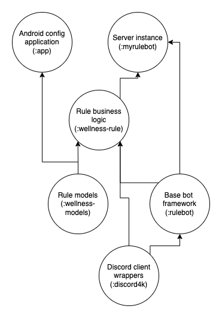
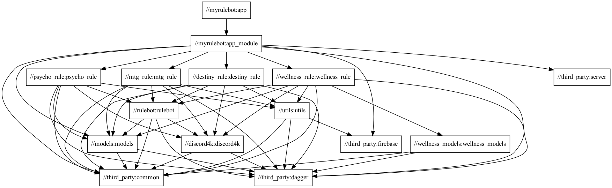

# Rule Discord Bot


## Summary

A modularized discord bot written in Kotlin. This project aims to demonstrate usage of a few design decisions:

- Bazel with domain specific macros to increase developer productivity
- Coroutine wrappers around a reactive library (Discord4j) to facilitate best practices
- Combining multiple bazel modules into a single distribution unit (Docker) in a CD environment
- Using shared kotlin models across the fullstack, a server instance and an android client

## Bazel workspace and conventions

Each module is implemented with minimal configuration using domain specific macros. The `bot_module`
macro defined in `tools/kotlin.bzl` applies common kotlin dependencies and compiler options. This reduces
boilerplate when creating a new feature (module). Rule modules leverage this macro inside another macro with common
dependencies needed for rules, `rule_module`. Tests are written the same way. The configuration below demonstrates the setup for
a typical rule. 

```
load("//tools:kotlin.bzl", "rule_module", "rule_test")

rule_module(
    name = "wellness_rule",
    deps = [
        "//wellness_models"
    ]
)

rule_test(
    name = "test",
    deps = [
        "//wellness_rule",
        "//wellness_models"
    ]
)
```

This makes it very simple to add new features with minimal overhead.

## Domain specific module breakdown

Code sharing across the stack is demonstrated in the module relation diagram below. Each "rule" is a modular piece of
logic that the chatbot packages as functionality. In the example of the "wellness" rule we would like to expose an api
to configure the rule, in this case to enable or disable for a particular server. A successful or failed configuration
should be communicated to the client with a corresponding response message. This is contained in a simple data class.

```kotlin
@Serializable
data class WellnessResponse(val message: String)
```

Since this is plain Kotlin (minus the serialization mechanism), we would like to reuse this via a lightweight module across our kotlin codebase
without a dependency on any server or discord code. The models for this rule are then split into a seperate bazel module.
Being isolated from any rule logic, this becomes a lightweight addition to our client configuration app. The diagram
below demonstrates the dependency chart for this rule.



Full breakdown of the graph generated by bazel




